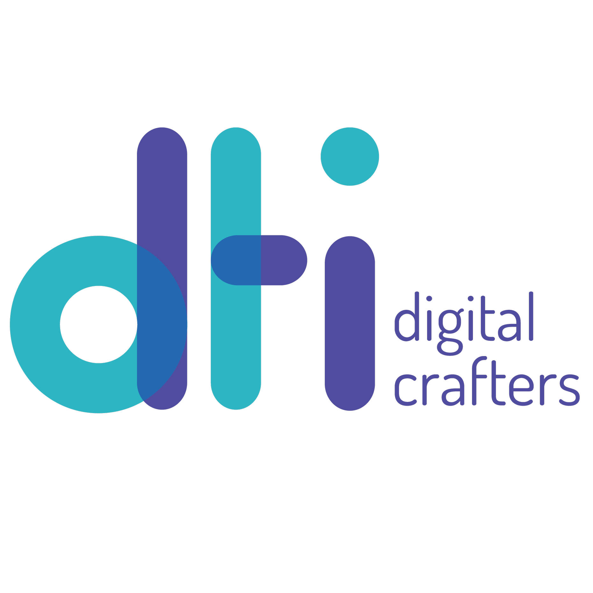
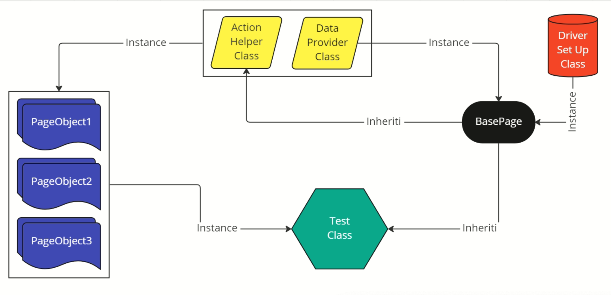

  
  <h1 align="center">... QA Automation</h1>
  

    This is an automation application to automate the E2E and API tests from ...
  

 

 

- [About this application](#about-this-application)
    - [Technologies](#technologies)
    - [Architecture](#architecture)

## About this application

This application goes is to ensure quality on the ... project and reduce regression time

### Technologies

| Stack                                                                                      | Version |
|--------------------------------------------------------------------------------------------|---------|
| [HomeBrew](/bin/bash -c "$(curl -fsSL https://raw.githubusercontent.com/Homebrew/install/HEAD/install.sh)") | Latest      |
| [Cypress](https://github.com/bonigarcia/webdrivermanager)                       | 13.7.2  |
| [Node](brew install node)                                                       | 18.15.0 |

### Architecture

